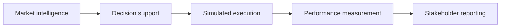
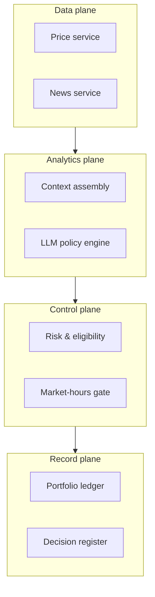
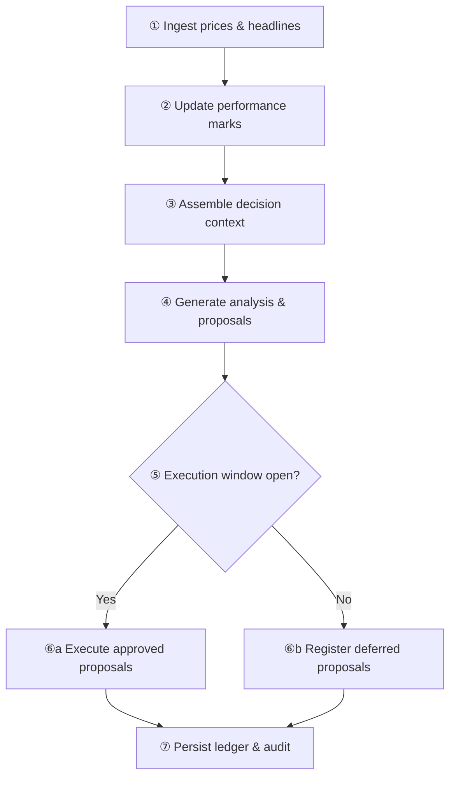
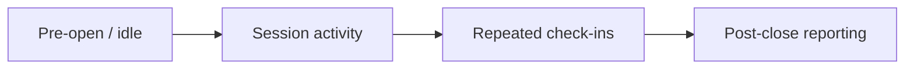
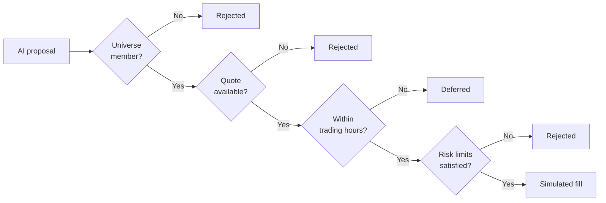
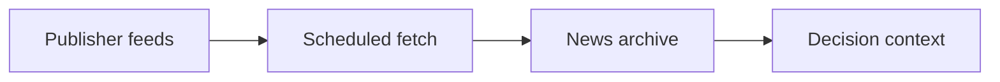
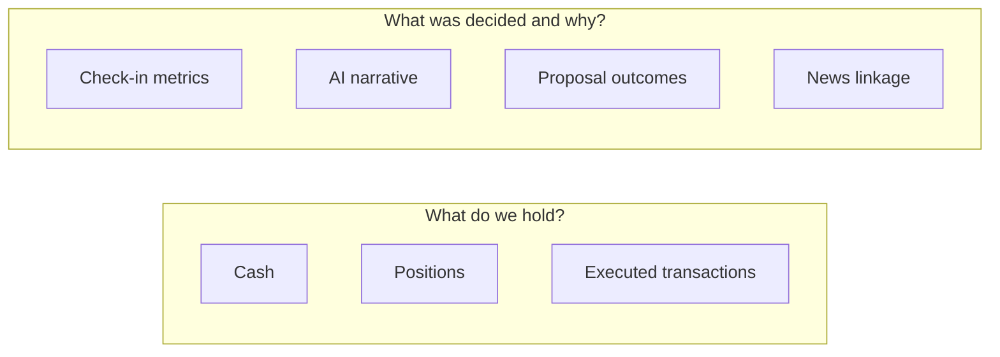
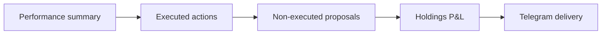

# TA-35 Paper Trading Platform — Business Overview

**Automated monitoring, AI-assisted decision support, and simulated execution for Israeli large-cap equities — with optional end-of-day stakeholder reporting.**

| | |
|---|---|
| **Classification** | Educational / research simulation |
| **Regulatory status** | Not investment advice; not a licensed portfolio management service |
| **Execution** | No connection to TASE, brokers, or custodians |

---

## Executive summary

The platform implements a **closed-loop research desk** for a TA-35-style equity universe:

1. **Ingest** public market prices and Hebrew-language financial headlines  
2. **Analyse** positions and news via a locally hosted large language model (LLM)  
3. **Recommend** buy/sell actions with documented rationale  
4. **Simulate** execution against a virtual portfolio subject to risk controls  
5. **Report** performance relative to the TA-35 benchmark and distribute a daily summary (Telegram, optional)

Capital at risk is **simulated only**. The system is designed for **transparency** (full decision log), **repeatability** (scheduled check-ins), and **benchmark discipline** (session-level comparison to `TA35.TA`).

---

## Capability matrix

| Capability | Description | Production trading equivalent |
|------------|-------------|------------------------------|
| Market data | End-of-cycle quotes for watchlist, holdings, and index proxy | Market data feed |
| News intelligence | RSS headline ingestion; company tagging; historical recall | News / NLP desk |
| Decision support | LLM-generated analysis and trade proposals (JSON) | Research / PM note |
| Execution simulation | Cash, positions, slippage, concentration limits | Order management (OMS) |
| Performance | NAV, return vs benchmark, alpha | Risk / performance reporting |
| Audit | Per-check-in log of proposals, executions, and rejections | Compliance blotter |
| Distribution | Daily Telegram digest: actions, reasons, P&L by line | Client reporting |

---

## Solution architecture (layered)

Single-direction pipeline — no crossing flows. Feedback (portfolio state into the next analysis) occurs **between** check-ins, not inside this view.

| Stage | Business function | Primary inputs | Primary outputs |
|-------|-------------------|----------------|-----------------|
| **Market intelligence** | Situational awareness | RSS feeds, Yahoo quotes | Headline set, price snapshot, news archive |
| **Decision support** | Policy view & trade ideas | Intelligence + portfolio + universe rules | Analysis text, proposed orders |
| **Simulated execution** | Apply ideas within guardrails | Proposals + risk rules + market hours | Updated virtual holdings |
| **Performance measurement** | Scorecard vs TA-35 | NAV, benchmark level | Return, alpha, session metrics |
| **Stakeholder reporting** | End-of-day communication | Wallet + audit + prices | Telegram summary (optional) |

---

## Operating model

### Roles (logical components)

| Plane | Responsibility |
|-------|----------------|
| **Data** | Fresh prices and headlines each check-in |
| **Analytics** | Merge data with portfolio; invoke local LLM |
| **Control** | Enforce universe, hours, cash, and position limits |
| **Record** | Persist holdings and immutable-style event log |

### Operating rhythm

**Check-in** — one end-to-end pass (default interval: 15 minutes while the service is running).

The sequence **repeats** on the configured schedule. It is distinct from an exchange session or a manual rebalance cycle.

**Trading window (simplified):** Sunday–Thursday, 09:00–17:35 Israel time. Outside the window, proposals may still be generated and logged; simulated execution is withheld.

**Daily reporting:** After 17:36 Israel time, at most one Telegram summary per calendar day (if enabled).

---

## Intraday timeline (conceptual)

Linear timeline — no backward arrows.

| Phase | Activity |
|-------|----------|
| **Pre-open** | Service may run; execution gate typically closed |
| **Session** | Check-ins ingest data; LLM runs; simulated trades when permitted |
| **Post-close** | Daily Telegram digest; no further trades until next open window |

---

## Decision governance

The LLM provides **recommendations only**. Execution requires sequential approval gates (linear path).

| Gate | Business rule |
|------|----------------|
| Universe | Symbol must be on the configured TA-35-style watchlist |
| Liquidity data | Valid price required for sizing |
| Market hours | No simulated fills outside the TASE window approximation |
| Risk | Sufficient cash; position size cap; positive quantity; slippage applied |

Every outcome — including deferrals and rejections — is written to the **decision register** with rationale text where available.

---

## News intelligence (RSS)

**RSS (Really Simple Syndication)** is the standard mechanism publishers use to distribute headline lists. The platform subscribes to configured feeds (default: Ynet, Globes, Calcalist), normalises titles, and:

- injects recent headlines into the LLM context each check-in  
- archives items in the decision register’s news store for cross-day continuity  
- attempts automatic mapping from headline text to issuer (Hebrew name, ticker, English name)

| Topic | Detail |
|-------|--------|
| Content depth | Headlines and metadata; not full article text |
| Language | Hebrew-first sources; rationale may be Hebrew |
| Availability | Feeds may block automated access; fallback content may apply |
| Compliance | Use licensed or permitted feeds in production deployments |

---

## Records and accountability

Two record types support different questions.

| Question | Record | Typical use |
|----------|--------|-------------|
| Current exposure? | **Portfolio ledger** (simulated wallet) | NAV, holdings, P&L |
| Why was a trade skipped? | **Decision register** (audit) | Governance review, model tuning |
| What news informed a period? | **News archive** | Post-hoc attribution |

---

## Simulated portfolio (paper trading)

**Paper trading** denotes execution against an internal ledger without market access.

| Attribute | Specification |
|-----------|----------------|
| Base currency | Israeli shekel (₪) |
| Default notional | ₪100,000 starting cash (configurable) |
| Universe | ~35 large-cap `.TA` symbols (snapshot list) |
| Benchmark | TA-35 index proxy via Yahoo (`TA35.TA`) |
| Simulation realism | Slippage, cash constraint, single-name concentration limit |

| Dimension | Live market | This platform |
|-----------|-------------|---------------|
| Order routing | Broker → exchange | Internal ledger update |
| Settlement | T+n, custody | Immediate in simulation |
| Regulatory reporting | Required | None |
| Best execution | Applicable | Not modelled |

---

## Stakeholder reporting (Telegram)

Reporting is **deterministic** (template + data). It does not use the LLM.

| Report block | Content |
|--------------|---------|
| **Performance** | NAV; session return; benchmark return; alpha |
| **Executed actions** | Buys/sells with quantity, price, and stated reason |
| **Exceptions** | After-hours or risk-blocked ideas retained in audit |
| **Holdings** | Unrealised and realised P&L by line item |

Telegram is **outbound notification only** — not a trading or command channel.

---

## Deployment modes

| Mode | Use case |
|------|----------|
| **Continuous** | Unattended operation with periodic check-ins |
| **Single check-in** | Validation, backtesting a point in time |
| **Report-only** | Push daily digest without running full analytics loop |

---

## Scope, assumptions, and limitations

| Domain | Assumption / limit |
|--------|-------------------|
| Index membership | Static catalog; may diverge from official TA-35 |
| Market data | Third-party (Yahoo); delays and errors possible |
| Corporate actions | Not modelled |
| Fees & taxes | Not modelled |
| Exchange calendar | Weekday/hour approximation; holidays omitted |
| Regulatory filings (Maya) | Not integrated; placeholder in context |
| AI reliability | Subject to hallucination and misread Hebrew |
| Legal | Operator bears responsibility; system is educational |

---

## Value proposition (concise)

| Stakeholder need | How the platform addresses it |
|------------------|-------------------------------|
| Structured experimentation | Repeatable check-ins with full audit trail |
| Benchmark discipline | Session anchored vs TA-35 |
| Explainability | Reasons stored for executed and non-executed proposals |
| Operational awareness | Optional end-of-day consolidated report |

---

## Documentation map

| Document | Audience |
|----------|----------|
| [BUSINESS_OVERVIEW.md](BUSINESS_OVERVIEW.md) | Product, risk, and operations (this document) |
| [SYSTEM_FLOW.md](SYSTEM_FLOW.md) | Engineering: modules, files, technical flows |
| [README.md](../README.md) | Installation and configuration |

---

*TA-35 Paper Trading Platform — business overview. Educational simulation; not for live order placement.*
