# TA-35 Paper Trader — Business Overview

**Practice investing in Israeli blue chips — with news, AI ideas, and daily updates — without risking real money.**

> Educational simulation only · Not regulated investment advice · No live trading

---

<!-- Slide 1 -->

## What is this?

A **desktop software assistant** that:

- Watches **Israeli large-cap stocks** (TA-35 style universe)
- Reads **Hebrew financial headlines** from major news sites
- Uses a **local AI** on your computer to suggest buys and sells
- Maintains a **practice portfolio** in Israeli shekels (₪)
- Compares results to the **TA-35 index**
- Can send a **daily summary to your phone** (Telegram)

**One sentence:** *It’s a flight simulator for stock decisions — not the real plane.*

---

<!-- Slide 2 -->

## Who is it for?

| Audience | Value |
|----------|--------|
| **Learners** | See how news and index performance might link to simple buy/sell choices |
| **Builders** | Experiment with AI + market data + alerts in one small project |
| **Analysts (informal)** | Get a structured daily log of “what the system did and why” |

**Not for:** live trading, compliance reporting, or production fund management.

---

<!-- Slide 3 -->

## What it does **not** do

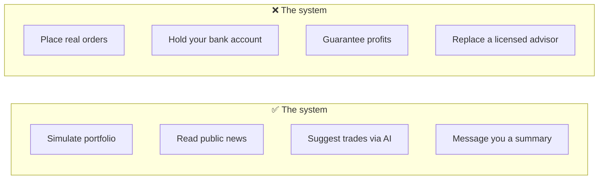

| | |
|---|---|
| **No broker connection** | Nothing is sent to TASE or any bank |
| **No real money** | Balances and trades exist only inside the app’s records |
| **No promise of returns** | Past simulation does not predict future results |

---

<!-- Slide 4 -->

## The big picture

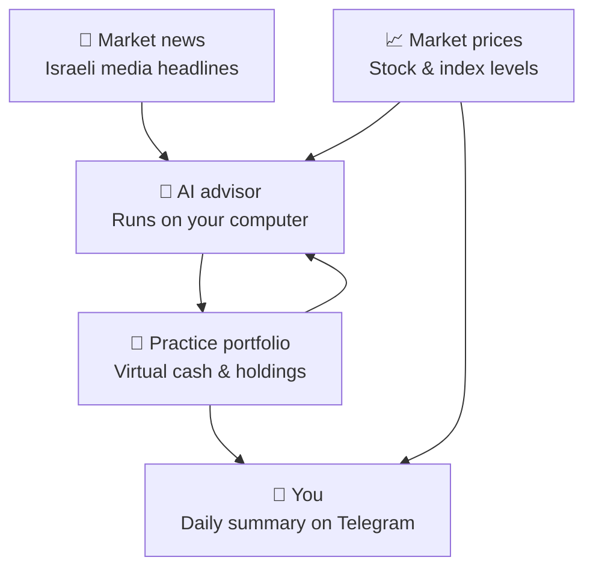

**Flow in plain language:**  
News and prices feed the AI → the AI proposes actions → the system updates your **practice** portfolio → you receive an end-of-day recap.

---

<!-- Slide 5 -->

## A day in the life

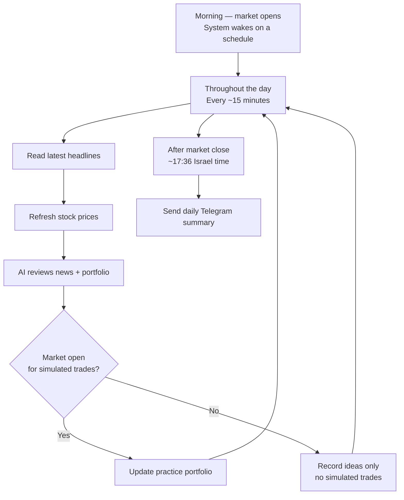

| Moment | What happens (business view) |
|--------|------------------------------|
| **During the day** | The assistant “checks in” regularly: new news, new prices, fresh AI view |
| **When the market is open** | Approved suggestions become **simulated** buys or sells |
| **When the market is closed** | The AI may still comment; **no** simulated trades are executed |
| **End of day** | Optional message: what traded, why, and profit/loss by holding |

---

<!-- Slide 6 -->

## The “heartbeat” — what is a cycle?

People often ask: *“What is a cycle?”*

| Term | Business meaning |
|------|------------------|
| **Cycle** | One complete check-in: news + prices + AI opinion + update records |
| **Schedule** | Default: every **15 minutes** while the program is running |
| **Not the same as** | A trading day, a stock exchange session, or a human “rebalance” meeting |

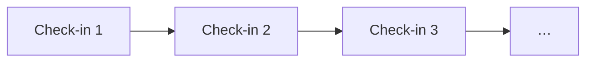

Think: **regular pulse of the assistant**, not a single end-of-day batch job.

---

<!-- Slide 7 -->

## Your practice portfolio

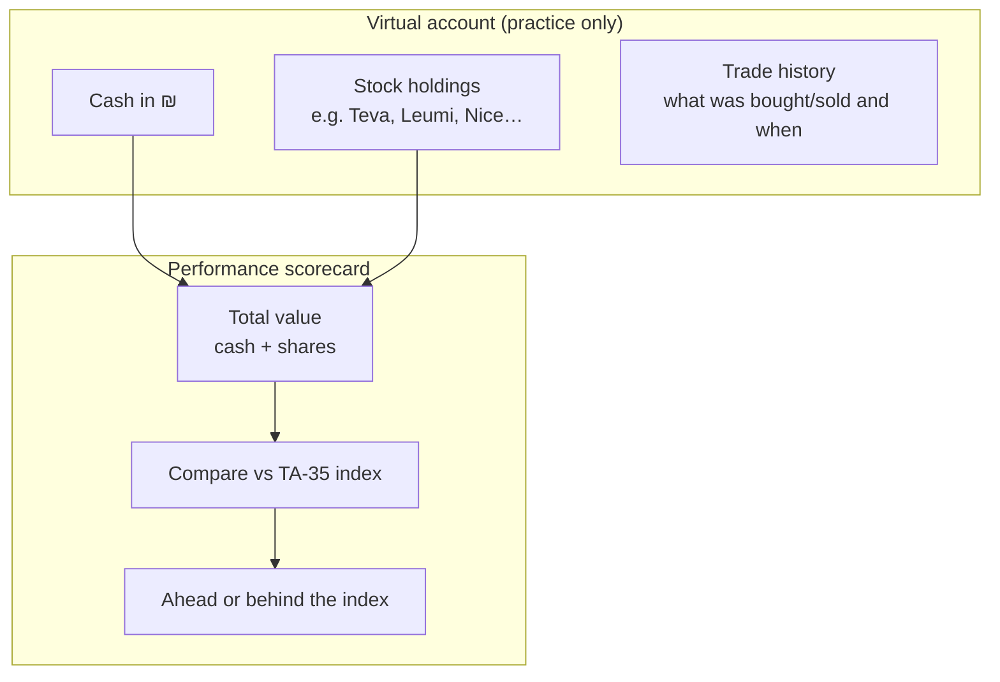

| Question | Answer |
|----------|--------|
| Where is it stored? | On your machine (a simple saved file the app reads/writes) |
| Starting amount | Default **₪100,000** (configurable) |
| Currency | Israeli shekels |
| Real custody? | **No** — numbers only |

---

<!-- Slide 8 -->

## How buy/sell decisions are made

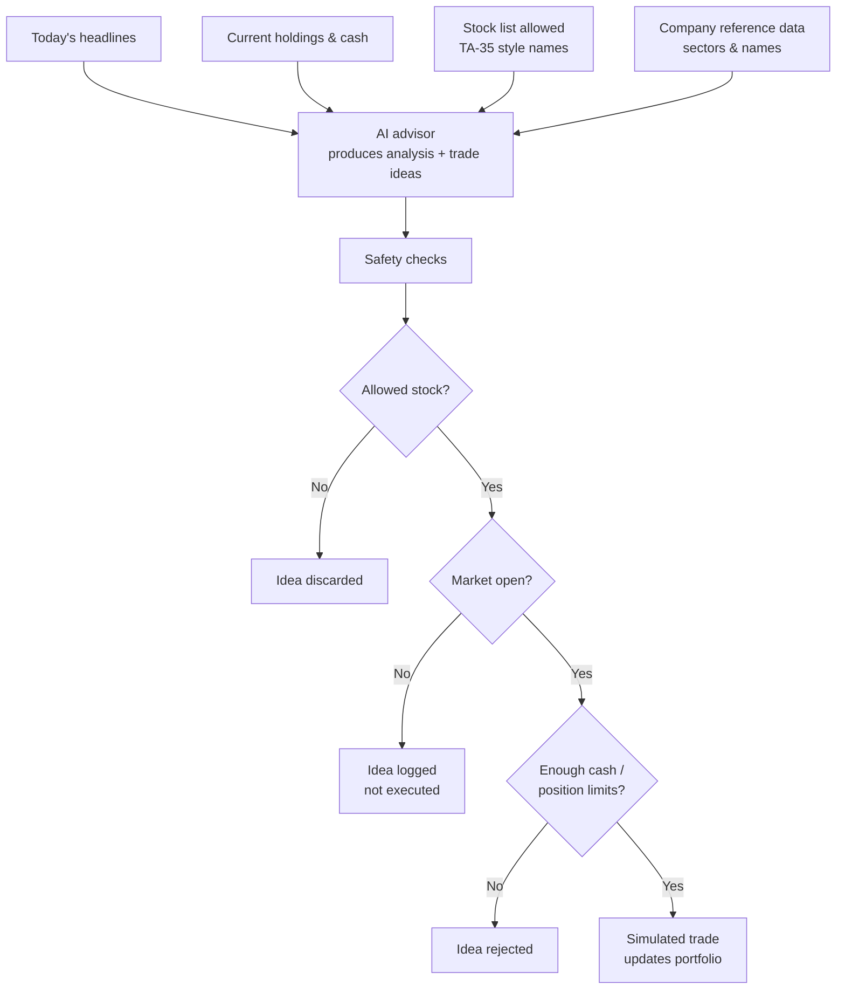

**Important:** The AI **suggests**; the software **enforces rules**. You get an audit trail of both executed and rejected ideas.

---

<!-- Slide 9 -->

## Where the news comes from (RSS)

**RSS** = how news websites publish a **running list of headlines**.

| For you | For the system |
|---------|----------------|
| Same headlines you’d see in news apps / sites | Pulled automatically on each check-in |
| Hebrew sources by default (Ynet, Globes, Calcalist) | Used as context for the AI |
| Public feeds (no paywall bypass) | Stored so older headlines can still inform later check-ins |

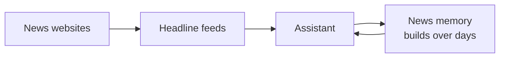

If feeds are unreachable, the system may use **placeholder headlines** so the rest of the demo still runs.

---

<!-- Slide 10 -->

## What the system remembers

Two complementary records — like **your wallet** vs **your diary**.

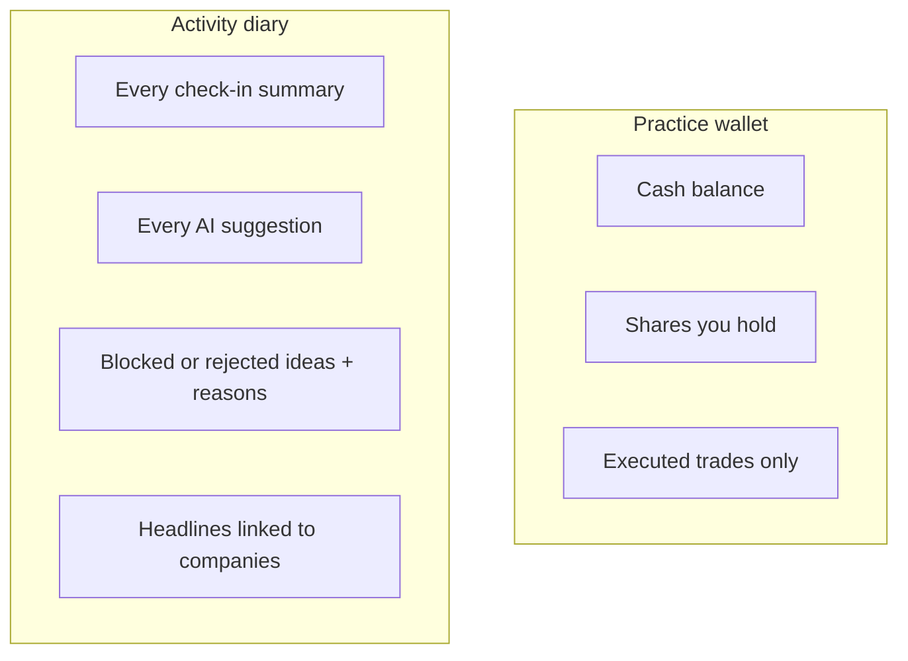

| Record type | Business role |
|-------------|---------------|
| **Practice wallet** | “What do I own right now?” |
| **Activity diary** | “What did the assistant think, try, or refuse — and why?” |

Use the diary to answer: *“Why didn’t it buy when the headline looked bullish?”*

---

<!-- Slide 11 -->

## Simulated trading (paper trading)

**Paper trading** = trading on paper, not on the exchange.

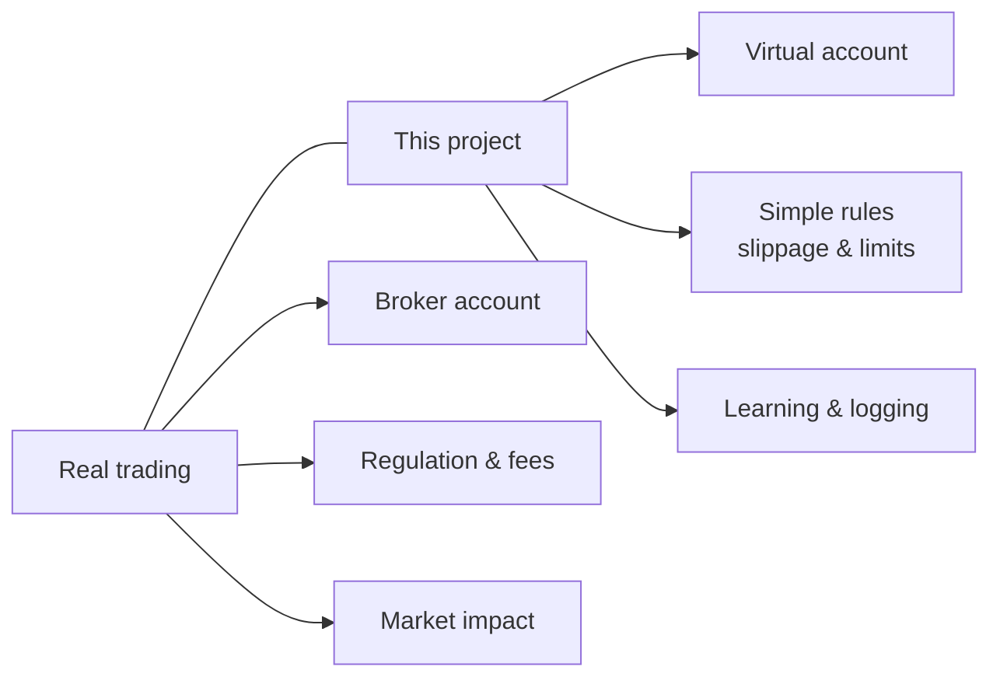

| Realistic touches in the simulation | |
|-------------------------------------|---|
| Slightly worse buy / better sell prices | Slippage |
| Cannot overload one stock | Position limit (% of portfolio) |
| Cannot spend cash you don’t have | Cash check |

Still: **no taxes, no fees model, no order book** — keep expectations modest.

---

<!-- Slide 12 -->

## What you get on Telegram

End-of-day **message to your phone** (optional):

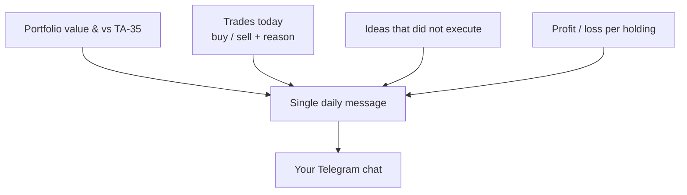

| Section | You see |
|---------|---------|
| **Performance** | Total value, return vs index |
| **Actions** | What changed in the practice portfolio and why (often Hebrew reasons from AI) |
| **Holdings** | Unrealized gain/loss per stock; realized where relevant |

**Telegram is reporting only** — you cannot trade by replying to the bot.

---

<!-- Slide 13 -->

## Operating modes

| Mode | When to use |
|------|-------------|
| **Continuous assistant** | Leave running; check-ins every N minutes |
| **Single check-in** | Run once and stop (testing) |
| **Daily report only** | Just send Telegram summary (e.g. cron at market close) |

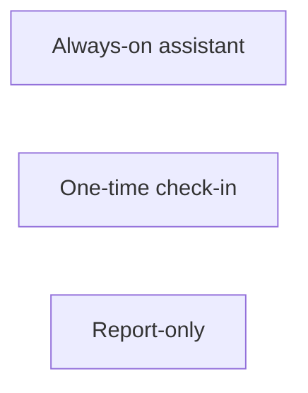

---

<!-- Slide 14 -->

## Universe & benchmark

| Item | Meaning |
|------|---------|
| **Stock universe** | ~35 large Israeli companies (`.TA` tickers on Yahoo) |
| **Benchmark** | TA-35 index level via `TA35.TA` proxy |
| **Goal (educational)** | See if the **practice portfolio** beats the index over a “session” |

Official index membership changes over time; the built-in list is a **convenience snapshot**, not a live TASE subscription.

---

<!-- Slide 15 -->

## Limitations (set expectations)

| Area | Limitation |
|------|------------|
| **Prices** | May be delayed or wrong for some Israeli symbols |
| **News** | Headlines only — not full articles; feeds may block automated access |
| **Calendar** | Simple Sun–Thu hours — not full TASE holiday calendar |
| **Filings** | Corporate disclosures (מאיה) — placeholder only today |
| **AI** | Can misunderstand Hebrew news or hallucinate links |
| **Legal** | Not investment advice; not audited |

---

<!-- Slide 16 -->

## Summary

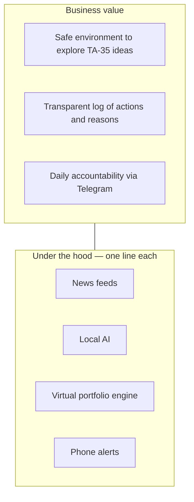

| | |
|---|---|
| **In one line** | An automated practice desk for Israeli large caps, with news-aware AI and optional daily phone summaries. |
| **Technical deep-dive** | [SYSTEM_FLOW.md](SYSTEM_FLOW.md) — for engineers |
| **Get started** | [README.md](../README.md) — install & configuration |

---

*Document version: business overview for the finance paper-trader project.*
