# System flow — TA-35 paper trader

Educational bot that **pretends** to trade Israeli large-cap stocks (Tel Aviv, symbols like `TEVA.TA`). It reads news, asks a local AI for opinions, updates a **fake portfolio** on disk, and can text you a daily summary on Telegram.

> **Not investment advice.** Money is simulated — nothing is sent to a real bank or broker.

---

## Concepts explained (read this first)

### What is a **cycle**?

A **cycle** is **one full lap** of the bot’s work. The function `run_cycle()` in `bot.py` does everything once:

1. Load your saved portfolio  
2. Download latest stock prices and news  
3. Ask Ollama (AI) what it thinks and whether to buy/sell  
4. Apply any allowed trades to the fake portfolio  
5. Save results to disk (and optionally send Telegram at end of day)

If you run `python -m demo_trader` without `--once`, the bot **repeats a cycle every N minutes** (default **15**), sleeps, then starts again. So:

| Term | Meaning |
|------|---------|
| **Cycle** | One complete ingest → analyze → (maybe) trade → save |
| **Loop** | Many cycles back-to-back until you stop the process |
| **Interval** | Minutes between cycles (`DEMO_TRADER_INTERVAL_MINUTES`) |

Think of a cycle like a single “heartbeat” of the trader — not a trading day, not a stock market session, just **one scheduled tick** of the program.

---

### What is **paper trading** / the **paper broker**?

**Paper trading** = practice trading with **fake money**. No orders go to the Tel Aviv Stock Exchange or any broker API.

The **paper broker** (`demo_trader/paper_broker.py`) is **Python code that simulates** what a broker would do:

| Real broker | Paper broker |
|-------------|----------------|
| Sends order to exchange | Updates numbers in `paper_state.json` |
| Deducts real cash | Subtracts from `cash_ils` |
| Credits shares to account | Adds to `positions` dict |
| May reject order | Returns `ok=False` + message (not enough cash, position too large, etc.) |

It also applies simple realism:

- **Slippage** — buys cost slightly more / sells receive slightly less than the quoted price (`DEMO_TRADER_SLIPPAGE_BPS`)  
- **Position cap** — you cannot put more than X% of portfolio in one stock (`DEMO_TRADER_MAX_POSITION_PCT`)  
- **Cash check** — cannot buy more than you have  

So when docs say “execute trade”, they mean **update the JSON file**, not “place a live order”.

---

### What is **`paper_state.json`**?

**File path:** `data/paper_state.json` (override with `DEMO_TRADER_STATE_PATH`)

This is your **simulated brokerage account** — the source of truth for cash, holdings, and trade history. Human-readable JSON on disk.

| Field | What it stores |
|-------|----------------|
| `cash_ils` | How much fake Israeli shekels are idle |
| `positions` | Map of symbol → share quantity, e.g. `"TEVA.TA": 10` |
| `trades[]` | Every buy/sell the paper broker actually executed (time, price, reason) |
| `session` | Snapshot from **first run**: starting NAV and benchmark level (for “how am I doing vs TA-35?”) |
| `last_cycle_ts` | When the last cycle finished (UTC) |
| `last_daily_report_il_date` | Prevents sending duplicate Telegram summaries same day |

**Example (simplified):**

```json
{
  "cash_ils": 95000.0,
  "positions": { "TEVA.TA": 100 },
  "trades": [
    {
      "ts": "2026-05-16T12:00:00+00:00",
      "symbol": "TEVA.TA",
      "side": "buy",
      "qty": 100,
      "price": 50.25,
      "notional_ils": 5025.0,
      "reason": "חיזוק פוזיציה לאחר חדשות"
    }
  ],
  "session": {
    "started_ts": "2026-05-15T08:00:00+00:00",
    "benchmark_symbol": "TA35.TA",
    "benchmark_start_px": 2100.0,
    "initial_nav_ils": 100000.0
  }
}
```

Telegram daily reports and P&L math **read this file** plus live prices from Yahoo.

---

### What is **`trader.db`**?

**File path:** `data/trader.db` (override with `DEMO_TRADER_DB_PATH`)

A **SQLite database** — a single file containing structured tables. Unlike `paper_state.json` (your wallet), `trader.db` is mainly an **audit log and news memory**:

| Table | Plain English purpose |
|-------|----------------------|
| `knowledge_events` | Headlines seen from RSS, optionally linked to a stock symbol |
| `companies` | TA-35 names/metadata (Hebrew names, sectors) |
| `cycles` | One row per **cycle**: NAV, returns vs benchmark, headline count |
| `decisions` | Everything the bot “decided” that cycle: AI summary, each trade attempt, blocks, errors |

**Why two stores?**

| `paper_state.json` | `trader.db` |
|--------------------|-------------|
| Current portfolio | History of *attempts* (including failed/blocked) |
| Only **executed** trades | AI `reason_he`, full context per cycle |
| Easy to reset/delete | Good for debugging “why didn’t it trade?” |

Example: model says “buy TEVA” at 20:00 → stored in `decisions` as `blocked_after_hours`; **no change** to `paper_state.json` positions.

---

### What is **RSS**?

**RSS** = a standard way websites publish **a list of recent articles** (XML feed). News sites expose URLs like:

- Ynet מבזקים  
- Globes  
- Calcalist  

The bot (`news_feeds.py`) **downloads those feeds**, parses titles/links, and uses them as **market context** for the AI. It does **not** scrape full article pages by default — usually just **headlines** (and sometimes dates).

| You configure | `DEMO_TRADER_RSS_FEEDS` (comma-separated URLs) |
| Used in | Every **cycle** — fresh fetch |
| Also saved to | `trader.db` → `knowledge_events` for later cycles |
| If feeds fail | Mock/demo headlines so the bot still runs |

RSS is **not** email and **not** Telegram — it is **pull-based news XML** from publisher URLs.

---

### What is **Ollama** / the **LLM**?

**Ollama** runs a language model **on your machine** (default `llama3.2`). Each cycle the bot sends one **prompt** (news + portfolio + rules) and gets back **JSON**: analysis text and a list of proposed trades.

The LLM **does not**:

- Touch `paper_state.json` directly  
- Connect to RSS or Yahoo  
- Send Telegram messages  

The Python code **reads** the JSON and **decides** whether to call the paper broker.

---

### What is **Telegram** in this project?

Optional **notification channel**. `daily_report.py` builds a text message (trades today, P&L per stock, NAV) and `telegram_notify.py` posts it via the **Telegram Bot API**.

- **Not** used for trading commands  
- **Not** powered by the LLM — fixed template + your data  
- Can run manually (`--daily-report`) or auto once per Israel day after ~17:36

---

### Other terms

| Term | Meaning |
|------|---------|
| **TA-35** | Tel Aviv 35 index — large Israeli companies; bot uses Yahoo symbol `TA35.TA` as benchmark |
| **Watchlist** | Symbols the model is **allowed** to trade (default: 35 `.TA` tickers) |
| **NAV** | Net asset value — cash + market value of all positions |
| **Benchmark** | Compare your fake portfolio return to the index proxy `TA35.TA` |
| **TASE hours gate** | Trades only execute Sun–Thu 09:00–17:35 Israel time (simplified) |
| **Knowledge ingest** | Match headline text to a stock symbol and save in `trader.db` (rules, not AI) |

---

## At a glance

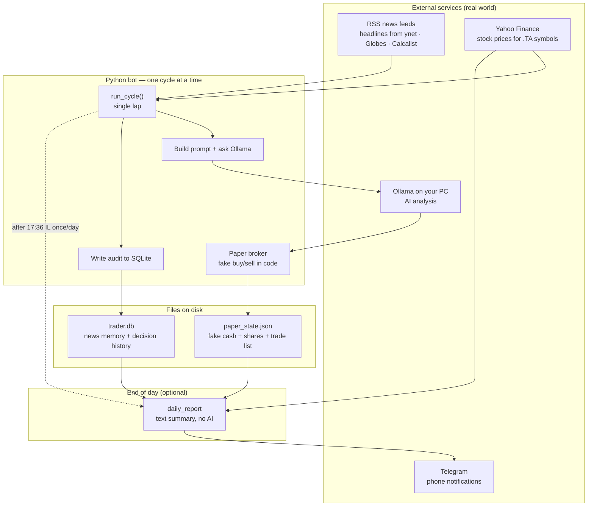

| Piece | One-line description |
|-------|----------------------|
| **Cycle** | One ingest → AI → maybe fake trade → save |
| **RSS** | Headline feeds from Israeli news sites |
| **`trader.db`** | SQLite: news memory + full decision audit log |
| **`paper_state.json`** | Your fake cash, shares, and executed trades |
| **Paper broker** | Code that updates `paper_state.json` like a broker would |
| **Ollama (LLM)** | Local AI: returns analysis + trade ideas as JSON |
| **Telegram** | End-of-day text report to your phone |

---

## How to run it

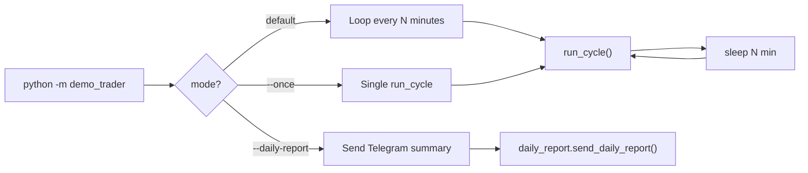

| Command | What happens |
|---------|----------------|
| `python -m demo_trader` | Endless loop: cycle → sleep (`DEMO_TRADER_INTERVAL_MINUTES`, default 15) |
| `python -m demo_trader --once` | One cycle, then exit |
| `python -m demo_trader --daily-report` | Build report → Telegram (or `--dry-run` → stdout) |
| `python -m demo_trader.daily_report` | Same as `--daily-report` (cron-friendly) |

---

## Main cycle (`run_cycle`) — step by step

Reminder: **one cycle** = load portfolio → prices + news → ask AI → maybe update `paper_state.json` → log everything to `trader.db` → save.

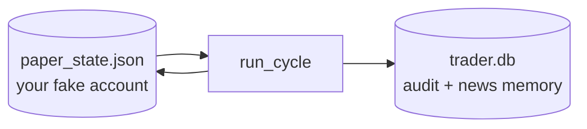

Detailed flow:

```mermaid
flowchart TD
    START([Start cycle]) --> LOAD[Load paper_state.json]
    LOAD --> PRICES[Fetch quotes via yfinance<br/>watchlist + positions + TA35.TA]
    PRICES --> BENCH{Benchmark<br/>quote OK?}
    BENCH -->|no| ERR([Exit code 2])
    BENCH -->|yes| MTM[Update trade mark-to-market<br/>in SQLite]

    MTM --> RSS[Fetch RSS headlines]
    RSS --> RSSOK{Any headlines?}
    RSSOK -->|no| MOCK[Use mock headlines]
    RSSOK -->|yes| INGEST
    MOCK --> INGEST[Match headlines → symbols<br/>insert knowledge_events]
    INGEST --> GATE{TASE trading<br/>hours?}
    GATE -->|Sun–Thu 09:00–17:35 IL| ALLOW[trading_allowed = yes]
    GATE -->|else| DENY[trading_allowed = no]

    ALLOW --> SESSION
    DENY --> SESSION[Ensure session snapshot<br/>NAV vs benchmark anchor]
    SESSION --> BUILD[Assemble LLM context blocks]
    BUILD --> LLM[Ollama chat JSON]
    LLM --> LLMOK{Ollama OK?}
    LLMOK -->|no| LOGERR[Log ollama_error to DB<br/>save state · exit 3]
    LLMOK -->|yes| PARSE[Parse analysis_he + trades[]]

    PARSE --> LOOP{For each proposed trade<br/>max N per cycle}
    LOOP --> WATCH{Symbol in<br/>watchlist?}
    WATCH -->|no| SKIP1[skip · log decision]
    WATCH -->|yes| QUOTE{Quote<br/>available?}
    QUOTE -->|no| SKIP2[skip · log decision]
    QUOTE -->|yes| HOURS{trading_allowed?}
    HOURS -->|no| BLOCK[blocked_after_hours<br/>log reason]
    HOURS -->|yes| TRADE[paper_broker.execute_trade]
    TRADE --> LOOP

    SKIP1 --> LOOP
    SKIP2 --> LOOP
    BLOCK --> LOOP

    LOOP -->|done| REFRESH[Refresh prices]
    REFRESH --> CYCLOG[Insert cycle + all decisions<br/>into SQLite]
    CYCLOG --> SAVE[Save paper_state.json]
    SAVE --> TGCHK{Telegram enabled<br/>and after 17:36 IL<br/>and not sent today?}
    TGCHK -->|yes| TGSEND[Send daily_report]
    TGCHK -->|no| END([End cycle · code 0])
    TGSEND --> END
```

### Phase map (same cycle, grouped)

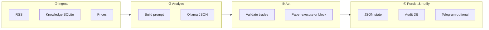

---

## RSS and knowledge flow

**RSS** supplies the “what’s in the news?” layer. Headlines are fetched **every cycle** (even at night when trading is blocked). New items are stored in **`trader.db`** so the AI can see **older headlines** from previous cycles, not only today’s fetch.

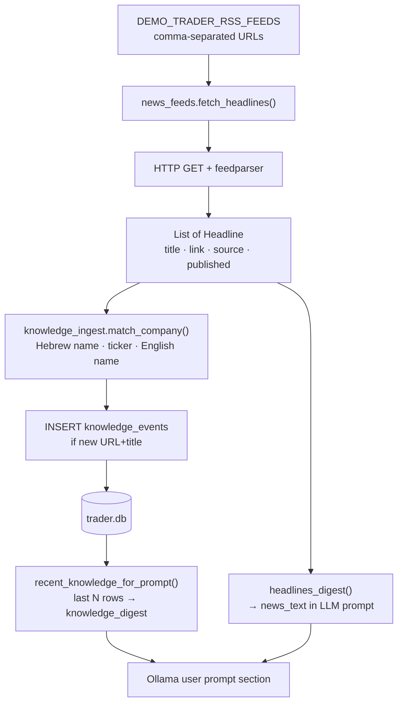

| Step | Module | Notes |
|------|--------|-------|
| Fetch | `news_feeds.py` | Falls back to **mock** headlines if all feeds fail (common in datacenters) |
| Digest | `news_feeds.py` | Up to 35 lines in prompt; prefixed with UTC timestamp |
| Match | `knowledge_ingest.py` | Rule-based, **no LLM** |
| Store | `db.py` | Deduped by `(url, title)` |
| Recall | `db.py` | Default 80 rows (`DEMO_TRADER_KNOWLEDGE_DB_ROWS`) |

---

## LLM analysis flow (Ollama)

**One LLM call per cycle.** The model returns structured JSON; the bot does not let the model touch the broker directly.

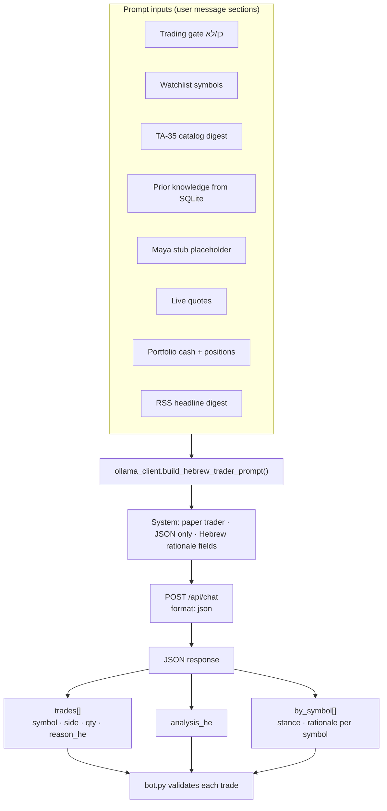

### Expected JSON shape (simplified)

```json
{
  "analysis_he": "short market view",
  "by_symbol": [
    { "symbol": "TEVA.TA", "stance": "hold", "rationale_he": "..." }
  ],
  "trades": [
    { "symbol": "TEVA.TA", "side": "buy", "qty": 10, "reason_he": "..." }
  ]
}
```

### Trade validation (after LLM)

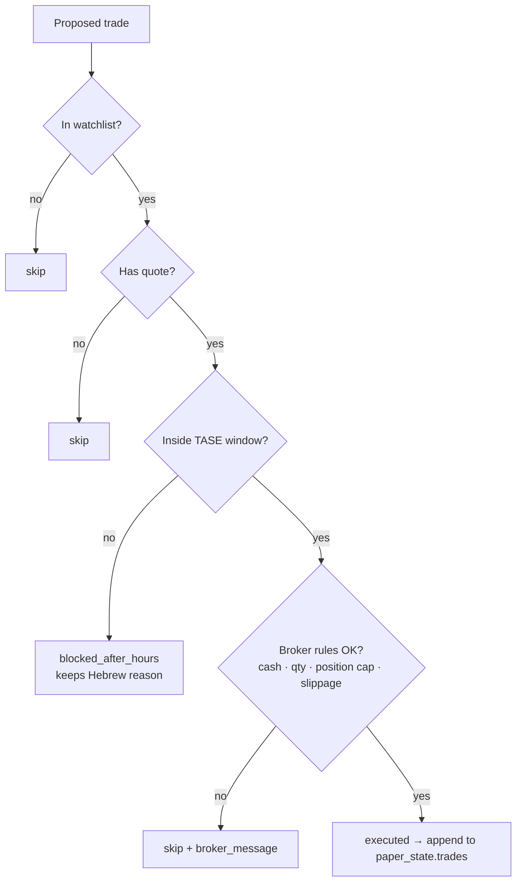

| Rule | Config |
|------|--------|
| Max trades per cycle | `DEMO_TRADER_MAX_TRADES_PER_CYCLE` (default 3) |
| Max position size | `DEMO_TRADER_MAX_POSITION_PCT` (default 25% NAV) |
| Slippage | `DEMO_TRADER_SLIPPAGE_BPS` (default 5 bps) |

---

## Paper portfolio and benchmark

All portfolio math reads **`paper_state.json`** + live prices. The paper broker only changes `cash_ils`, `positions`, and appends to `trades[]`.

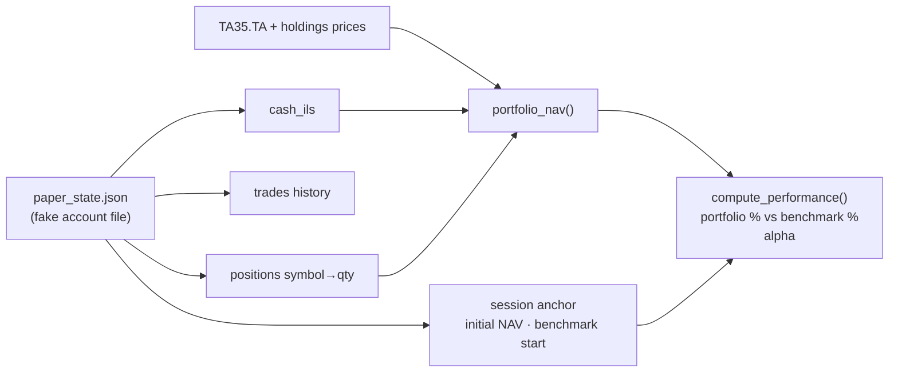

- **Session** starts on first cycle: locks initial NAV and `TA35.TA` level.
- Every cycle logs **portfolio_return_pct**, **benchmark_return_pct**, **alpha** into SQLite `cycles` table.

---

## SQLite audit trail (`trader.db`)

**`trader.db`** is optional for “having a portfolio” (that’s JSON), but required for rich history: every cycle’s performance, every AI rationale, every blocked trade.

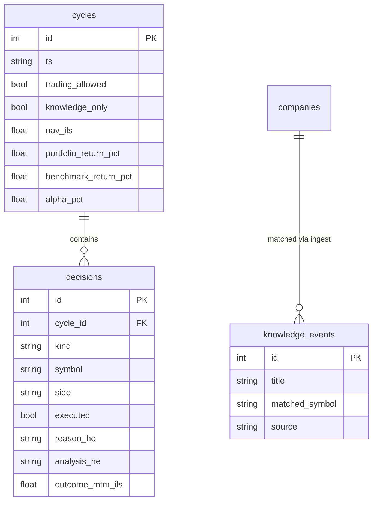

| `decisions.kind` | Meaning |
|------------------|---------|
| `llm_summary` | Model analysis before trades |
| `trade` | Buy/sell attempt (executed or broker-rejected) |
| `blocked_after_hours` | Model wanted trade; gate closed |
| `skip` | Invalid symbol, no quote, or broker reject |
| `ollama_error` | LLM call failed |

---

## Telegram daily summary flow

Telegram is **separate from the LLM**: a deterministic report built from state, prices, and the audit DB.

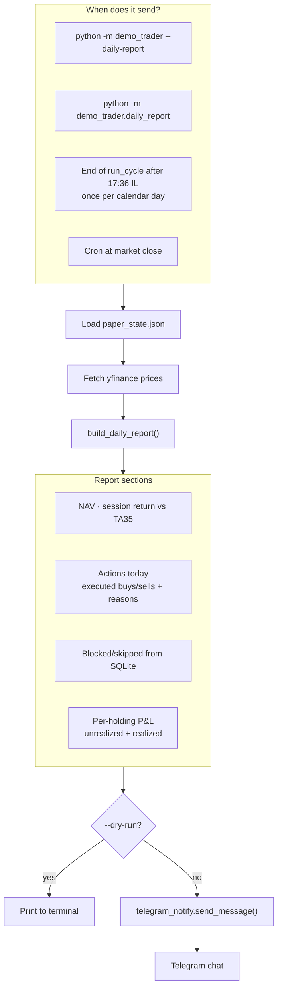

### P&L calculation (holdings)

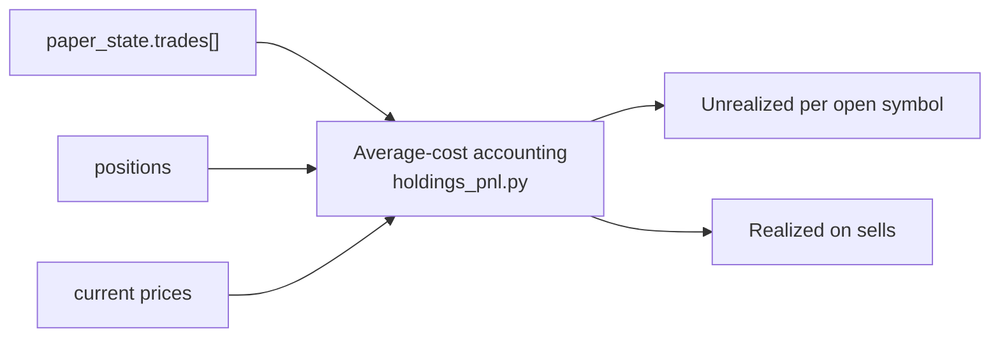

Env vars:

| Variable | Purpose |
|----------|---------|
| `DEMO_TRADER_TELEGRAM_ENABLED` | `1` to enable auto-send in loop |
| `TELEGRAM_BOT_TOKEN` | From @BotFather |
| `TELEGRAM_CHAT_ID` | Your chat id |
| `DEMO_TRADER_TELEGRAM_DAILY_HOUR` | Default `17` |
| `DEMO_TRADER_TELEGRAM_DAILY_MINUTE` | Default `36` |

---

## Static context (no network)

These blocks are injected into the LLM prompt every cycle:

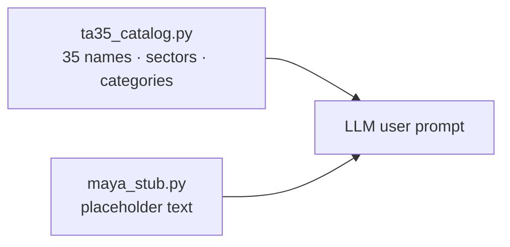

Maya is reserved for future TASE/Maya API integration; today it only informs the model that live filings are not loaded.

---

## File map

| File | Responsibility |
|------|----------------|
| `demo_trader/bot.py` | Orchestrator: `run_cycle()`, CLI |
| `demo_trader/news_feeds.py` | RSS fetch + headline digest |
| `demo_trader/knowledge_ingest.py` | Headline → symbol matching |
| `demo_trader/db.py` | SQLite schema, cycles, decisions, knowledge |
| `demo_trader/ollama_client.py` | Prompt builder + Ollama HTTP |
| `demo_trader/paper_broker.py` | Simulated execution |
| `demo_trader/benchmark.py` | NAV vs `TA35.TA` |
| `demo_trader/tase_calendar.py` | Trading-hours gate |
| `demo_trader/daily_report.py` | Telegram report builder |
| `demo_trader/telegram_notify.py` | Telegram HTTP client |
| `demo_trader/holdings_pnl.py` | Per-holding P&L math |
| `data/paper_state.json` | Portfolio state |
| `data/trader.db` | Audit + knowledge |

---

## Timing diagram (typical day)

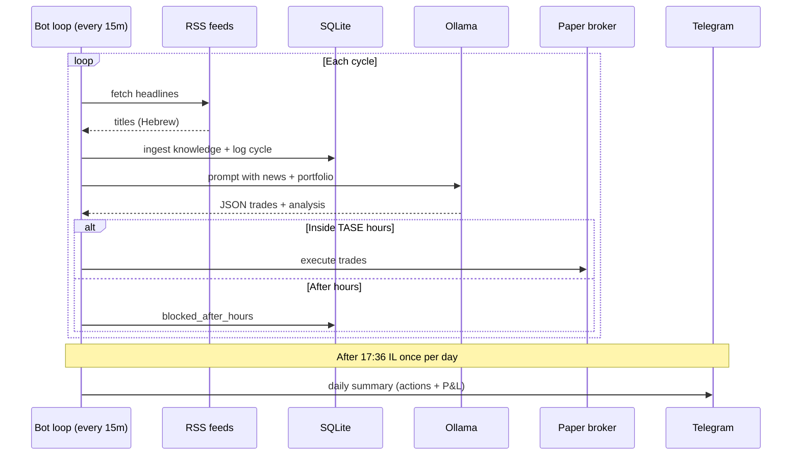

---

## Quick reference: where is data written?

| Event | `paper_state.json` | `trader.db` |
|-------|-------------------|-------------|
| Successful buy/sell | ✅ cash, positions, `trades[]` | ✅ `decisions` row (`executed=1`) |
| AI says buy, market closed | ❌ no change | ✅ `blocked_after_hours` |
| AI says buy, not enough cash | ❌ no change | ✅ `decisions` + `broker_message` |
| RSS headline ingested | ❌ | ✅ `knowledge_events` |
| Cycle finished | ✅ `last_cycle_ts` | ✅ `cycles` row (NAV, alpha, etc.) |
| Telegram sent today | ✅ `last_daily_report_il_date` | ❌ |

---

## Related docs

- [README.md](../README.md) — quick start and env vars
- Prompt text — `demo_trader/ollama_client.py` (`build_hebrew_trader_prompt`)
