# System flow — TA-35 paper trader

Educational paper-trading bot for Israeli large caps (`.TA` symbols). This document explains how **RSS**, **SQLite knowledge**, **Ollama (LLM)**, **paper execution**, and **Telegram** fit together.

> **Not investment advice.** No live broker connection.

---

## At a glance

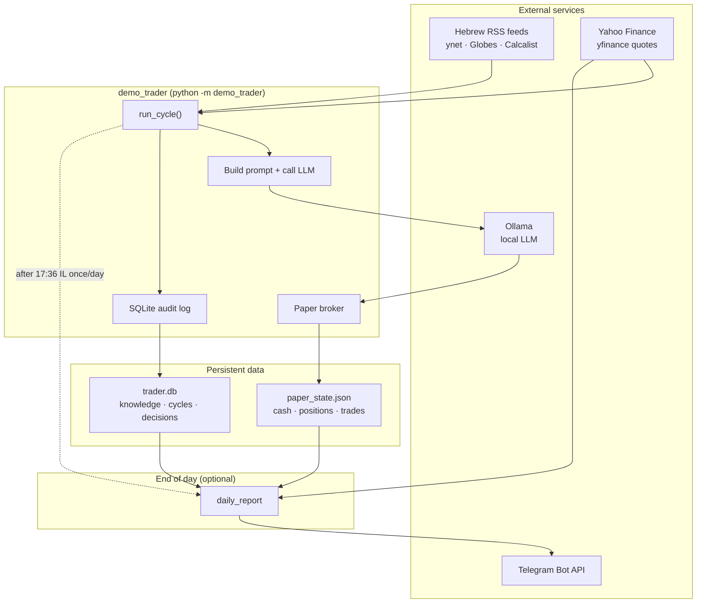

| Layer | Role |
|-------|------|
| **RSS** | Fresh Hebrew headlines each cycle |
| **Knowledge DB** | Remember headlines across cycles; match titles → symbols |
| **LLM** | One JSON decision per cycle: analysis + optional trades |
| **Paper broker** | Simulated buy/sell with slippage and position limits |
| **Telegram** | Human-readable daily summary (no LLM) |

---

## How to run it

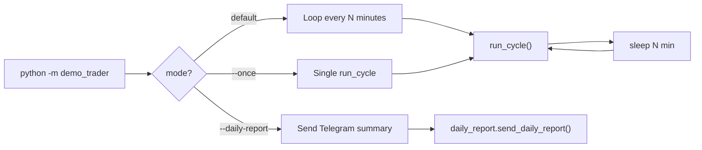

| Command | What happens |
|---------|----------------|
| `python -m demo_trader` | Endless loop: cycle → sleep (`DEMO_TRADER_INTERVAL_MINUTES`, default 15) |
| `python -m demo_trader --once` | One cycle, then exit |
| `python -m demo_trader --daily-report` | Build report → Telegram (or `--dry-run` → stdout) |
| `python -m demo_trader.daily_report` | Same as `--daily-report` (cron-friendly) |

---

## Main cycle (`run_cycle`) — step by step

Each cycle is **one pass** through data collection, analysis, optional trades, and persistence.

```mermaid
flowchart TD
    START([Start cycle]) --> LOAD[Load paper_state.json]
    LOAD --> PRICES[Fetch quotes via yfinance<br/>watchlist + positions + TA35.TA]
    PRICES --> BENCH{Benchmark<br/>quote OK?}
    BENCH -->|no| ERR([Exit code 2])
    BENCH -->|yes| MTM[Update trade mark-to-market<br/>in SQLite]

    MTM --> RSS[Fetch RSS headlines]
    RSS --> RSSOK{Any headlines?}
    RSSOK -->|no| MOCK[Use mock headlines]
    RSSOK -->|yes| INGEST
    MOCK --> INGEST[Match headlines → symbols<br/>insert knowledge_events]
    INGEST --> GATE{TASE trading<br/>hours?}
    GATE -->|Sun–Thu 09:00–17:35 IL| ALLOW[trading_allowed = yes]
    GATE -->|else| DENY[trading_allowed = no]

    ALLOW --> SESSION
    DENY --> SESSION[Ensure session snapshot<br/>NAV vs benchmark anchor]
    SESSION --> BUILD[Assemble LLM context blocks]
    BUILD --> LLM[Ollama chat JSON]
    LLM --> LLMOK{Ollama OK?}
    LLMOK -->|no| LOGERR[Log ollama_error to DB<br/>save state · exit 3]
    LLMOK -->|yes| PARSE[Parse analysis_he + trades[]]

    PARSE --> LOOP{For each proposed trade<br/>max N per cycle}
    LOOP --> WATCH{Symbol in<br/>watchlist?}
    WATCH -->|no| SKIP1[skip · log decision]
    WATCH -->|yes| QUOTE{Quote<br/>available?}
    QUOTE -->|no| SKIP2[skip · log decision]
    QUOTE -->|yes| HOURS{trading_allowed?}
    HOURS -->|no| BLOCK[blocked_after_hours<br/>log reason]
    HOURS -->|yes| TRADE[paper_broker.execute_trade]
    TRADE --> LOOP

    SKIP1 --> LOOP
    SKIP2 --> LOOP
    BLOCK --> LOOP

    LOOP -->|done| REFRESH[Refresh prices]
    REFRESH --> CYCLOG[Insert cycle + all decisions<br/>into SQLite]
    CYCLOG --> SAVE[Save paper_state.json]
    SAVE --> TGCHK{Telegram enabled<br/>and after 17:36 IL<br/>and not sent today?}
    TGCHK -->|yes| TGSEND[Send daily_report]
    TGCHK -->|no| END([End cycle · code 0])
    TGSEND --> END
```

### Phase map (same cycle, grouped)

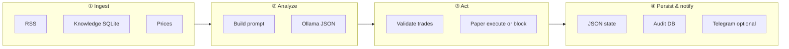

---

## RSS and knowledge flow

Headlines are fetched **every cycle** (not only when trading). Knowledge survives in SQLite for later prompts.

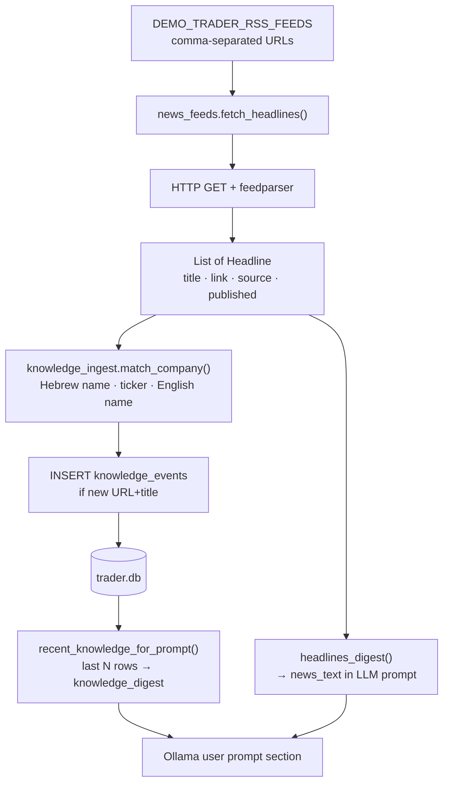

| Step | Module | Notes |
|------|--------|-------|
| Fetch | `news_feeds.py` | Falls back to **mock** headlines if all feeds fail (common in datacenters) |
| Digest | `news_feeds.py` | Up to 35 lines in prompt; prefixed with UTC timestamp |
| Match | `knowledge_ingest.py` | Rule-based, **no LLM** |
| Store | `db.py` | Deduped by `(url, title)` |
| Recall | `db.py` | Default 80 rows (`DEMO_TRADER_KNOWLEDGE_DB_ROWS`) |

---

## LLM analysis flow (Ollama)

**One LLM call per cycle.** The model returns structured JSON; the bot does not let the model touch the broker directly.

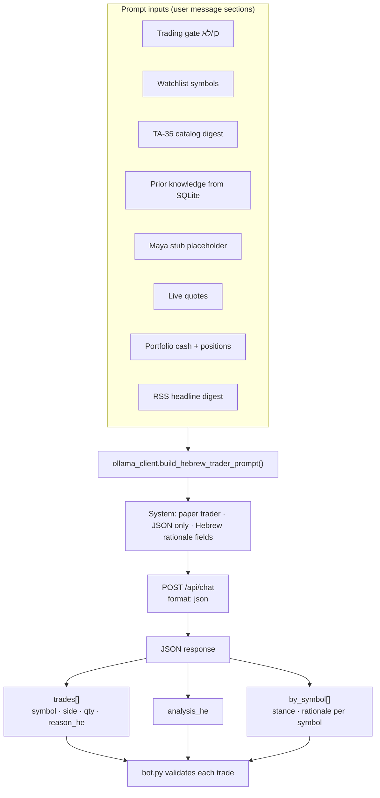

### Expected JSON shape (simplified)

```json
{
  "analysis_he": "short market view",
  "by_symbol": [
    { "symbol": "TEVA.TA", "stance": "hold", "rationale_he": "..." }
  ],
  "trades": [
    { "symbol": "TEVA.TA", "side": "buy", "qty": 10, "reason_he": "..." }
  ]
}
```

### Trade validation (after LLM)

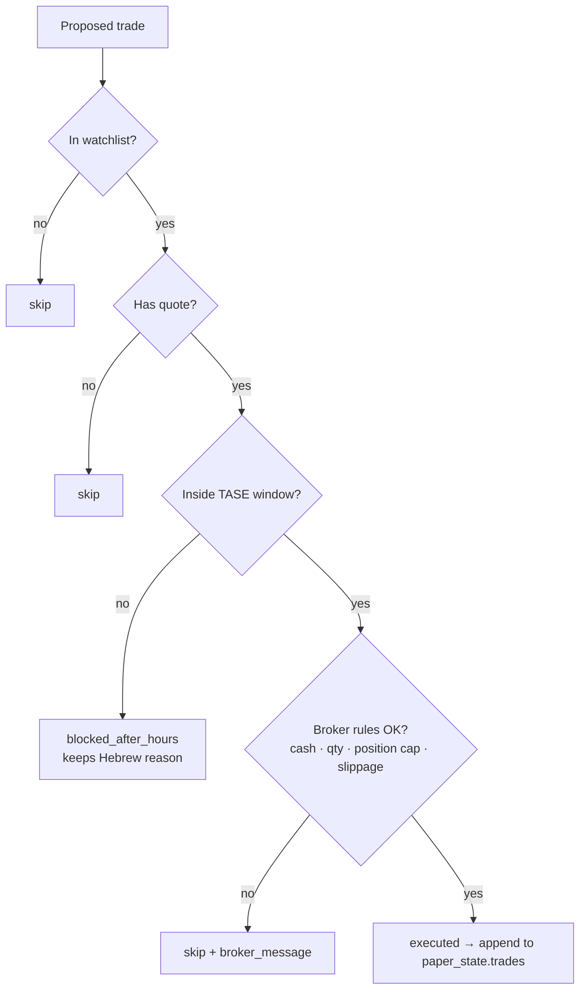

| Rule | Config |
|------|--------|
| Max trades per cycle | `DEMO_TRADER_MAX_TRADES_PER_CYCLE` (default 3) |
| Max position size | `DEMO_TRADER_MAX_POSITION_PCT` (default 25% NAV) |
| Slippage | `DEMO_TRADER_SLIPPAGE_BPS` (default 5 bps) |

---

## Paper portfolio and benchmark

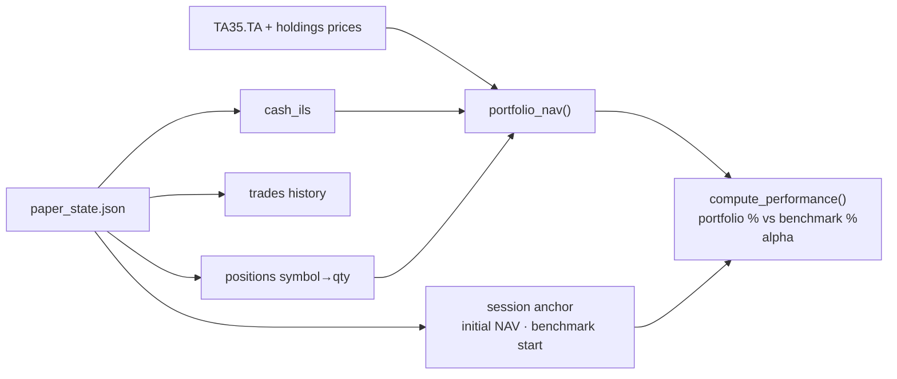

- **Session** starts on first cycle: locks initial NAV and `TA35.TA` level.
- Every cycle logs **portfolio_return_pct**, **benchmark_return_pct**, **alpha** into SQLite `cycles` table.

---

## SQLite audit trail

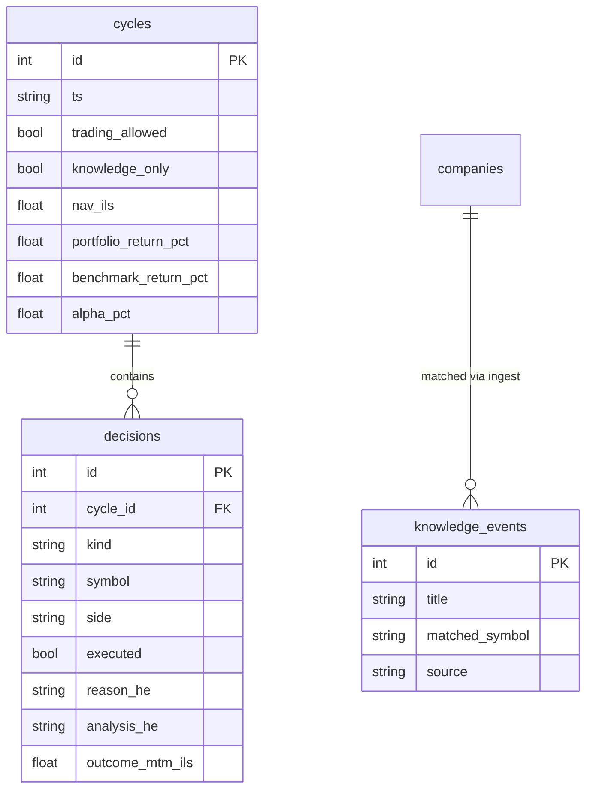

| `decisions.kind` | Meaning |
|------------------|---------|
| `llm_summary` | Model analysis before trades |
| `trade` | Buy/sell attempt (executed or broker-rejected) |
| `blocked_after_hours` | Model wanted trade; gate closed |
| `skip` | Invalid symbol, no quote, or broker reject |
| `ollama_error` | LLM call failed |

---

## Telegram daily summary flow

Telegram is **separate from the LLM**: a deterministic report built from state, prices, and the audit DB.

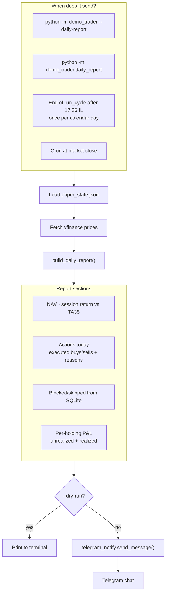

### P&L calculation (holdings)

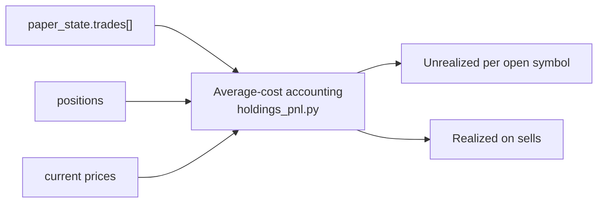

Env vars:

| Variable | Purpose |
|----------|---------|
| `DEMO_TRADER_TELEGRAM_ENABLED` | `1` to enable auto-send in loop |
| `TELEGRAM_BOT_TOKEN` | From @BotFather |
| `TELEGRAM_CHAT_ID` | Your chat id |
| `DEMO_TRADER_TELEGRAM_DAILY_HOUR` | Default `17` |
| `DEMO_TRADER_TELEGRAM_DAILY_MINUTE` | Default `36` |

---

## Static context (no network)

These blocks are injected into the LLM prompt every cycle:

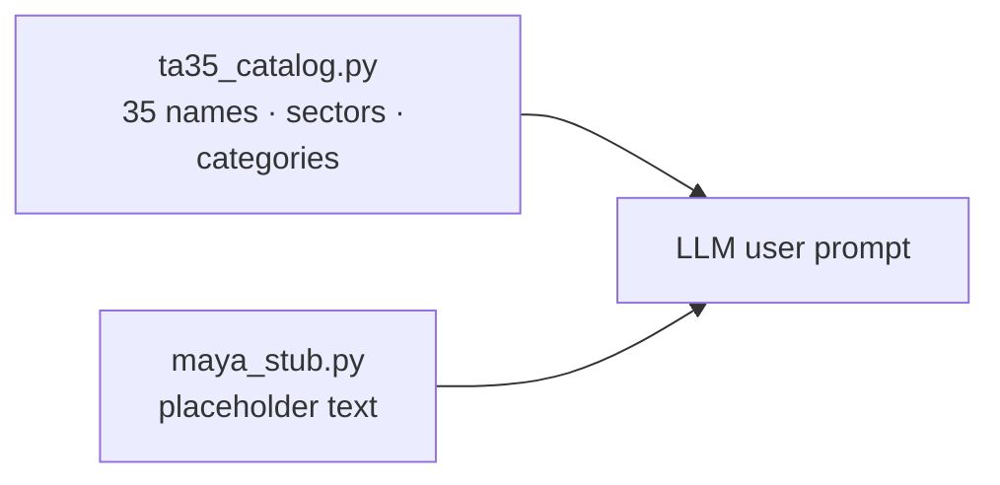

Maya is reserved for future TASE/Maya API integration; today it only informs the model that live filings are not loaded.

---

## File map

| File | Responsibility |
|------|----------------|
| `demo_trader/bot.py` | Orchestrator: `run_cycle()`, CLI |
| `demo_trader/news_feeds.py` | RSS fetch + headline digest |
| `demo_trader/knowledge_ingest.py` | Headline → symbol matching |
| `demo_trader/db.py` | SQLite schema, cycles, decisions, knowledge |
| `demo_trader/ollama_client.py` | Prompt builder + Ollama HTTP |
| `demo_trader/paper_broker.py` | Simulated execution |
| `demo_trader/benchmark.py` | NAV vs `TA35.TA` |
| `demo_trader/tase_calendar.py` | Trading-hours gate |
| `demo_trader/daily_report.py` | Telegram report builder |
| `demo_trader/telegram_notify.py` | Telegram HTTP client |
| `demo_trader/holdings_pnl.py` | Per-holding P&L math |
| `data/paper_state.json` | Portfolio state |
| `data/trader.db` | Audit + knowledge |

---

## Timing diagram (typical day)

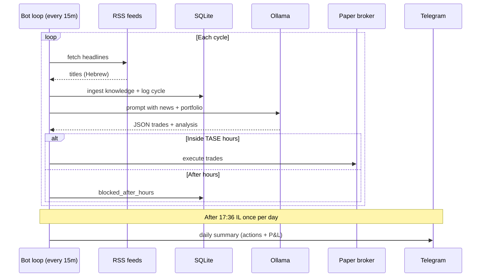

---

## Related docs

- [README.md](../README.md) — quick start and env vars
- Prompt text reference — see `demo_trader/ollama_client.py` (`build_hebrew_trader_prompt`)
